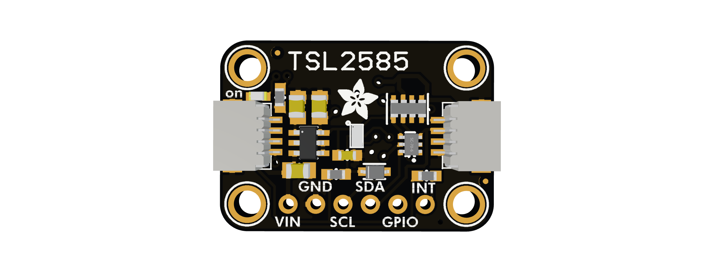

# Adafruit TSL2585 Library 

This is the Adafruit Arduino library for the ams OSRAM TSL2585 / TSL25853
ambient light, infrared, and UVA sensor.

The TSL2585 uses I2C to communicate. The sensor provides three independently
amplified optical channels, factory UVA calibration, and a programmable
measurement sequencer.

## About the TSL2585

The TSL2585 is a miniature optical sensor with:

* A photopic channel shaped for the human eye response
* A 315 nm to 400 nm UVA channel
* A near-infrared channel
* Per-channel gain from 0.5x to 4096x
* Predictive and analog-saturation automatic gain control
* Programmable integration time
* Programmable ALS threshold interrupts
* GPIO input and open-drain output control
* A fixed I2C address of `0x39`

## Default configuration

`begin()` configures a simple one-step, three-channel ALS measurement:

| Setting | Default | Source and purpose |
| --- | --- | --- |
| Result format | Unscaled 16-bit full counts | Application note section 3.2.1 |
| Sample period | 250 us | Datasheet Figure 23 default |
| Integration | 200 samples, 50 ms | Library default for register-based results |
| Sequencer | ALS step 0 only | No flicker, residual, VSYNC, or wait measurement |
| Photodiode map | Photopic to modulator 0, IR to 1, UVA to 2 | Application note Table 1 |
| Starting gain | 128x per channel | Datasheet reset gain |
| Maximum gain | 4096x | Allows AGC and manual gain to use the full range |
| AGC | Predictive and saturation AGC on step 0 | Runs before every sequencer round |

Call `enableAGC(false)` before setting fixed manual gains. Calling
`enableAGC(true)` restarts measurements and runs both AGC methods using the
current calibration schedule. The default is every sequencer round;
`setCalibrationInterval()` can select a less frequent schedule or startup
only. The same schedule also controls auto-zero calibration, so frequent
calibration can slow the measurement rate. See section 2.5 of the ams OSRAM
[basic-settings application note](https://look.ams-osram.com/m/34f87e9823e25d2d/original/TSL2585-ALS-flicker-Basic-settings-and-read-out-of-results.pdf).

`readData()` returns raw counts, the actual gain used for each channel, and the
gain-normalized `photopic_1x`, `infrared_1x`, and `uva_1x` counts. The `uva_1x`
result also includes the sensor's factory OTP correction. These values are
equivalent to the typical response at 1x gain, but retain the configured
integration time; they are not lux or irradiance.

## Installation

To install, use the Arduino Library Manager and search for "Adafruit TSL2585".

## Dependencies

* [Adafruit BusIO](https://github.com/adafruit/Adafruit_BusIO)

## Contributing

Contributions are welcome. Please open an issue or pull request on GitHub.

## Documentation and Doxygen

Documentation is generated with Doxygen. Examples are included in the
`examples` folder, and deterministic hardware tests are in `extras/hw_tests`.

## About this driver

Written by Limor Fried and the Adafruit team for Adafruit Industries.

MIT license. See `LICENSE` for more information. All text above must be
included in any redistribution.
